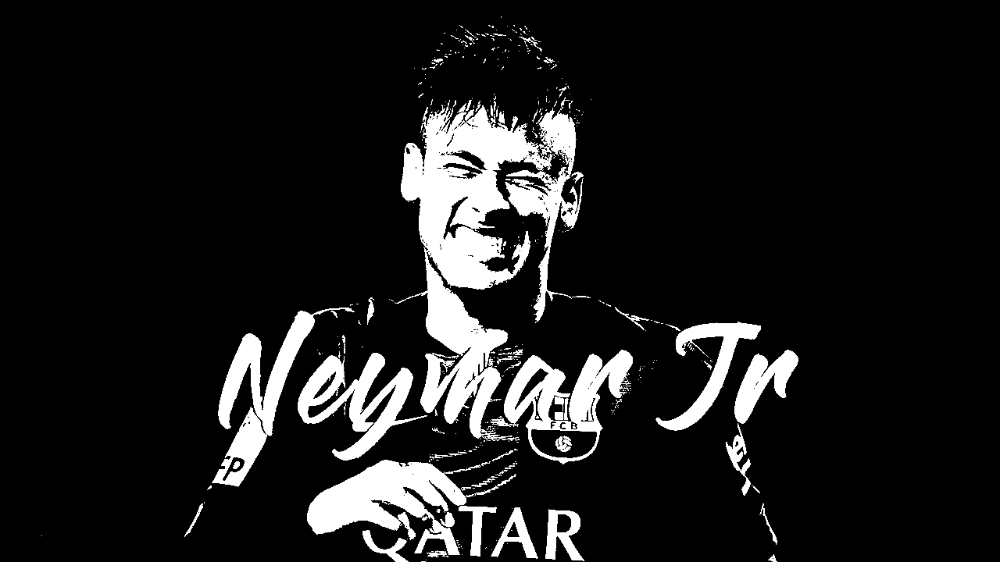
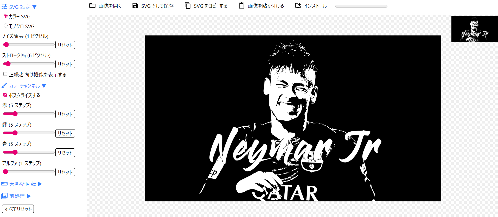
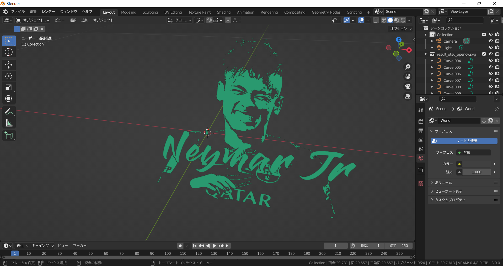
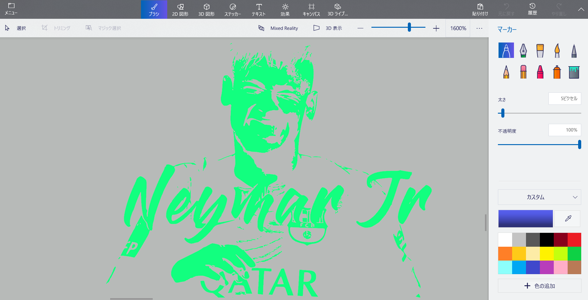

# image_to_svg

ラスター画像を2値化、SVGのベクトル画像に変換し、Blenderで扱える3DCGデータにする。(色は3DCG化したデータにマテリアルを貼ることで対応)

Convert raster images to binary and SVG vector images to make 3DCG data that can be handled by Blender. (Colors are handled by attaching materials to the 3DCG data.)

## Convert raster images to binary (ラスター画像を2値化)

Binarization.py

```
python Binarization.py --img sample_picture.png --method default
```

--methodは,hist_threshのハイパーパラメータの指定
'default', 'otsu', 'met', 'percentile'の4パタンある.
opencvのotsuと差を出すには,defaultを使っておけば良い.
percentile も使いどころはありそう.

--method is a hyperparameter for hist_thresh.
There are four patterns: 'default', 'otsu', 'met', and 'percentile'.
If you want to make a difference with opencv's otsu, you should use default.
percentile is also useful.

hist_thresh
<https://github.com/jonbarron/hist_thresh>

古くて新しい2値化画像処理を動かしてみる(ECCV 2020論文)
<https://tech-blog.optim.co.jp/entry/2020/10/12/090000>




## Convert SVG vector images from binary (SVGのベクトル画像に変換)

SVGcode: A PWA to Convert Raster Images to SVG Vector Graphics

<https://github.com/tomayac/SVGcode>

<https://svgco.de/>

ブラウザ上で、2値化した画像をSVGのベクトル画像に変換できる。SVG変換のパラメータ調整も出来て便利。

You can convert binarized images to SVG vector images in your browser, and adjust the SVG conversion parameters.




## to make 3DCG data that can be handled by Blender (Blenderで扱える3DCGデータにする)

SVGをblenderにインポートすれば、3DCGデータとして扱うことが出来る。マテリアルの設定で色付けも可能。

If you import SVG into blender, you can handle it as 3DCG data. Colorization is also possible by setting the material.



## Attached the FBX file for your reference

実行結果の参考になるようにFBXファイルを添付しました。3DCGデータは扱いやすいようにカーブの削減と結合、簡単なマテリアルの貼り付けがblender上で行ってあります。

Blender3.0／SVGの使い方（ロゴやベクターの読み込み）
※「限定的溶解」を適度に行った後、モディファイアのソリッド化で厚みを持たせると良い

<https://signyamo.blog/blender_svg/>

FBX files are attached for reference, and the 3DCG data has been reduced and merged with curves and simple materials pasted in blender for easy handling.


[sample_picture_otsu.fbx](sample_picture_otsu.fbx)



